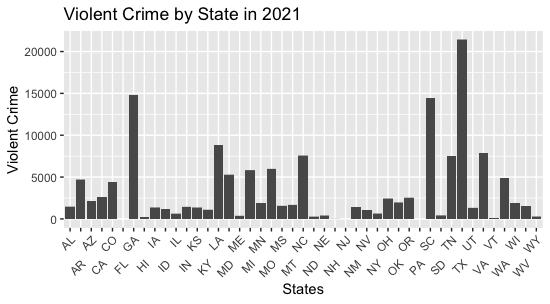
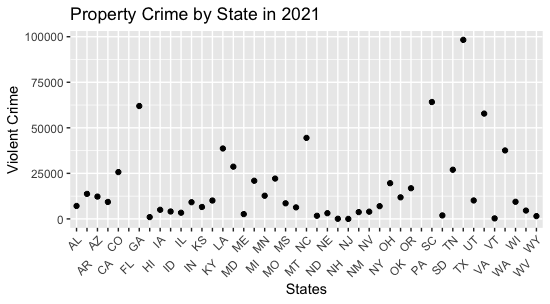

```{r setup, include=FALSE}
knitr::opts_chunk$set(echo = TRUE)
```

## Summary

The dataset used to analyze crime in the United States takes into account crimes that have occurred in every county in the United States. The crimes are categorized into violent crime and property crime. Violent crime includes murder, rape, robbery, aggravated assault, while property crime includes burglary, larceny theft, vehicle theft and arson. Crime data was recorded in the dataset from 2028 counties and broken down into the categories mentioned above. Other values are the maximum number of property crimes occuring in a county are 998. The maximum number of violent crimes are 99. There are a total of 13 columns of data describing statistics from each county.

### Quick Facts

Number of Counties:
```{r}
source("../source/indexDocValues.R")
print(number_of_rows)
```

Number of Columns in the Dataset:
```{r}
source("../source/indexDocValues.R")
print(number_of_columns)
```
Highest Number of Violent Crimes in a County:
```{r}
source("../source/indexDocValues.R")
print(max_violent_crimes)
```
Highest Number of People Murdered in a County:

136

Highest Number of Propery Crimes in a County:
```{r}
source("../source/indexDocValues.R")
print(max_propery_crime)
```

### Table 1. Aggregated Data

| Recorded Counties    | Highest Number of Violent Crime | Highest Number of Property Crime     | Number of Columns  |  Highest Number of Murders |
| :----:               |    :----:                       |   :----:                             |   :----:           |  :---------:               |
|     2028             | 99                              | 998                                  |       13           |               136          |

In the table shown above, it is seen that the values correspond to those in the quick facts sections and the dynamic paragraph. There are 2028 counties from diffrent years that are data set has. The highest number of violent crime in a county is 99. The highest number of property crime is 998. The number of columns in the data set is 13. And the highest number of murders in a given county is 136.


### Table 2. Dataset Information



This visualization shows the violent crime distribution by state. As shown, Texas has the highest level of violent crime, above 20,000.
On the other hand, crime in Florida, New Hampshire, New Jersey, Philadelphia, hacve virtually no levels oif violent crime, most likely due to an error in the \
dataset.



This visualization shows the property crime numbers per state. As shown, Texas has the most property crime according to the dataset.
